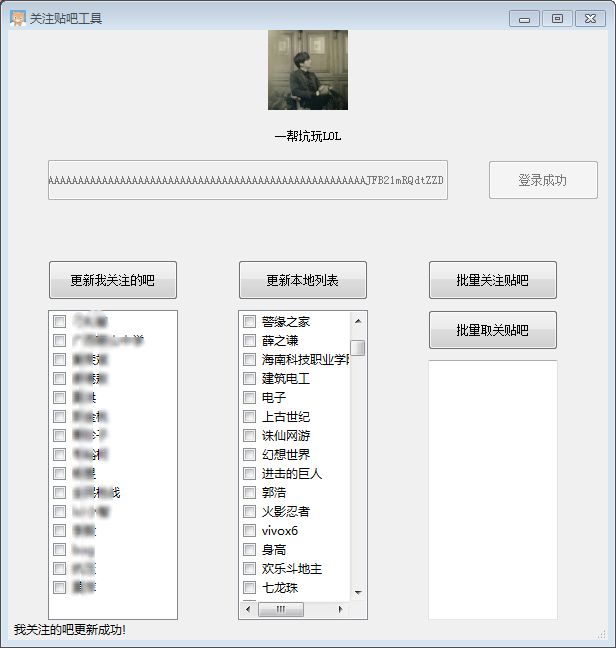

# TieBaTool

- 功能
    + 贴吧批量关注和取关
    + lists.json 包含两千多个贴吧, 可以增加或减少
- 版本
    + python 3.6
    + PyQt 5
- 用法
    + 使用 pyinstaller 打包:
        * pyinstaller -w -i xx.ico TieBaTool.py
    + 将 lists.json 和 xx.jpg 复制到 dist\TieBaTool 文件夹下面
    + 双击 TieBaTool.exe 打开
- 已知问题
    + 如果网络不通畅将出现问题(以后再改代码)
    + 通过 BDUSS 登录成功, 但是不可以进行关注贴吧操作(建议在浏览器获取 BDUSS)
- 日志
    + 2018年1月15日 实现最基本功能, 界面贼丑, 代码极烂

